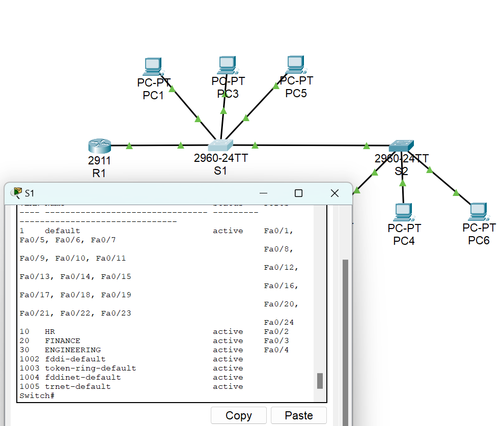
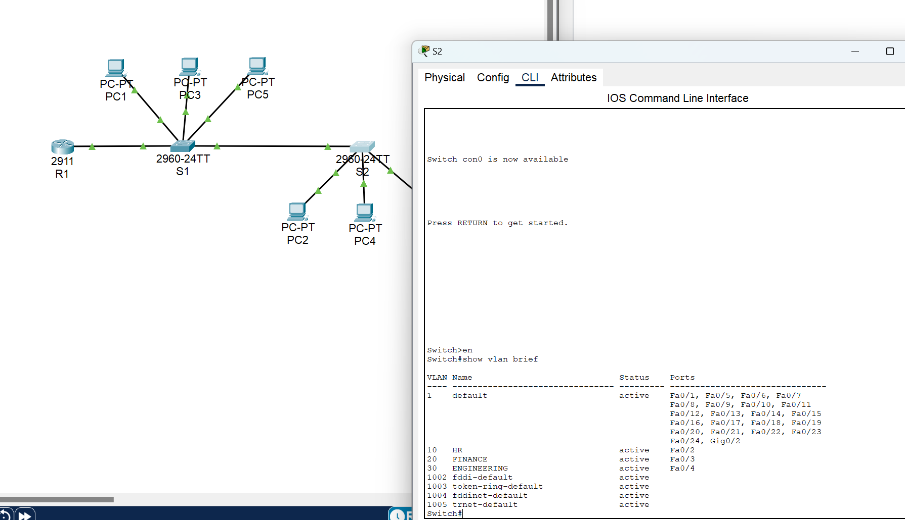
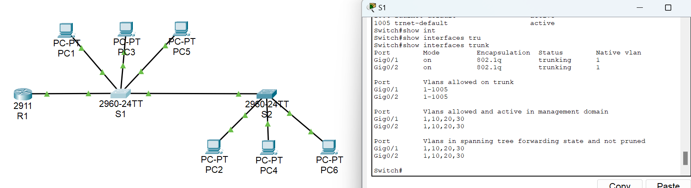
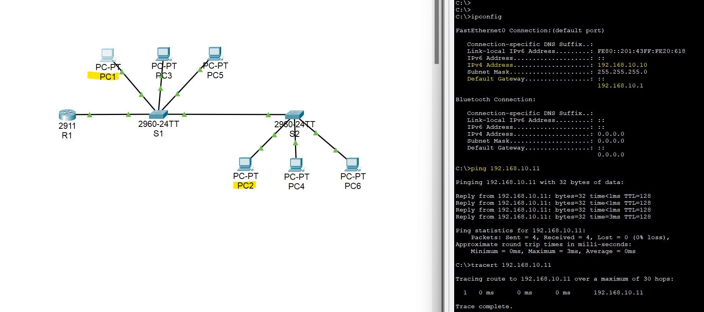
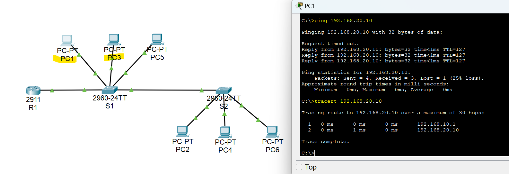
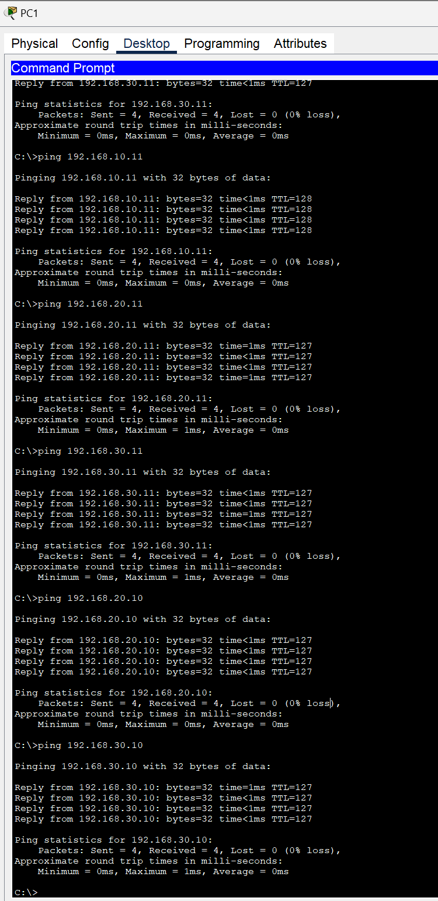
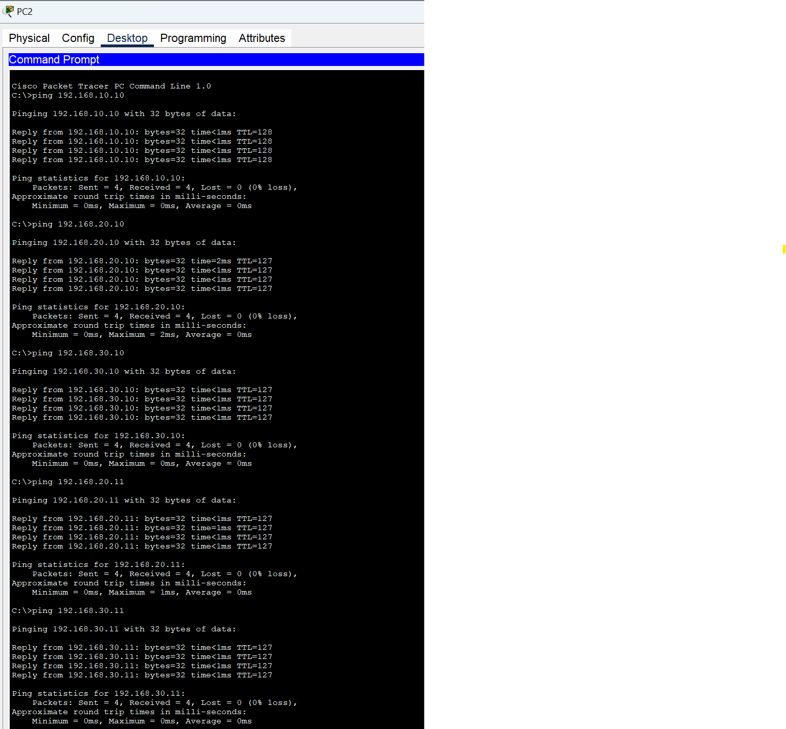

# Lab 2: Advanced VLANs, Trunking, and Inter-VLAN Routing

This lab demonstrates configuration and verification of **VLANs**, **802.1Q trunking**, and **inter-VLAN routing** using Cisco switches and routed interfaces / SVIs in Cisco Packet Tracer.

---

## Task 1: VLAN Verification

### S1: `show vlan brief`

### S2: `show vlan brief`

The `show vlan brief` command confirms that:
- All required VLANs (e.g., VLAN 10, VLAN 20, VLAN 30) are created.  
- Access ports are correctly assigned to the appropriate VLANs.  

Key checkpoints:
- Each PC-facing switchport is in the correct VLAN.  
- No user ports remain in the default VLAN unless intentionally configured.

---

## Task 2: Trunk Status (`show interfaces trunk` on S1 & S2)

### Switch S1 Trunks

The `show interfaces trunk` output on S1 should verify:
- Trunk ports (e.g., `Fa0/1`, `Fa0/2`) are in **trunk** mode.  
- Encapsulation is **802.1Q** (dot1q), if manually configurable on the platform.  
- The **allowed VLAN list** includes all VLANs that must span between S1 and S2.

### Switch S2 Trunks

On S2, `show interfaces trunk` confirms:
- Matching trunk configuration toward S1 and the inter-VLAN router / L3 switch.  
- The same VLANs are allowed and active on the trunk.  
- There are no unexpected pruning or VLAN mismatches on the link.

---

## Task 3: Inter-VLAN Connectivity (PC1 ↔ PC2 ↔ PC3)

### Ping Tests Between VLANs

Successful pings from **PC1** (in one VLAN) to **PC2** and **PC3** (in other VLANs) confirm:
- Inter-VLAN routing is configured correctly (via **router-on-a-stick** or **SVIs**).  
- Default gateways on each PC point to the correct VLAN interface IP.  
- VLAN tagging on trunks is working end-to-end.

### Full Mesh Ping Tests

- PC1 pinging all other PCs.  

- PC2 pinging all other PCs.  

These tests show:
- All PCs in different VLANs can reach each other through the L3 device.  
- There are no misconfigured access ports or missing VLANs on trunks.  
- The inter-VLAN routing path is symmetric and stable for all hosts.

---

## Commands Used (Reference)

Some commonly used verification commands in this lab:

